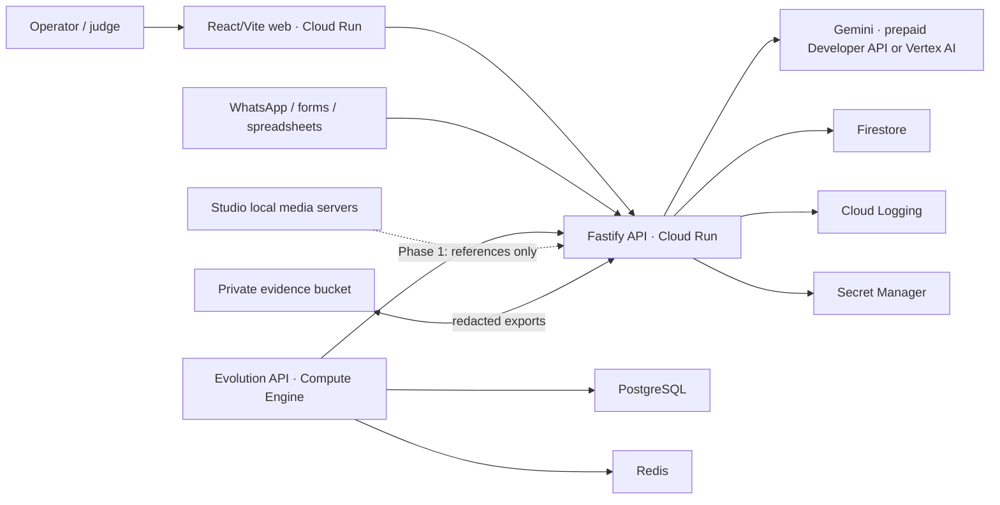

# Architecture

## System view

## Environments

| Environment | Data | Gemini | Outbound | Purpose |
|---|---|---|---|---|
| Local | synthetic | optional | blocked | development |
| Integration | synthetic/redacted | optional | blocked | reusable local-flow validation |
| GCP staging | synthetic | real controlled calls | blocked | deployment and evidence |
| GCP production | consented real data | real | shadow mode, then approved | customer operation |

## Components

### Web

React and Vite provide the executive dashboard, customer timeline, playbook
switch, agent control room, approval queue, billing queue, and evidence mode.
The static build is served by Nginx on Cloud Run. The foundation UI currently
uses synthetic data and is intentionally labelled.

### API

Fastify provides bounded endpoints, validation, rate limiting, structured logs,
PII redaction, deterministic demo analysis, and the Vertex AI adapter. Write
endpoints require an admin key outside demo mode.

### Gemini

`@google/genai` is behind a server-side provider adapter. The controlled
staging environment uses a Gemini Developer API key restricted to
`generativelanguage.googleapis.com`, stored in Secret Manager, and attached to
an AI Studio prepaid billing plan. Vertex AI remains available through
Application Default Credentials. API keys are never exposed to the browser or
repository.

The intake call returns structured business analysis. It is a decision-support
step, not autonomous execution. Pricing and outbound text remain approval-bound.
Every completed call records tenant, model, input/output tokens, estimated
list-price cost, latency, request reference, and human-approval state.

Staging has three cost controls:

- AI Studio prepaid balance with automatic reload disabled;
- a USD 5 monthly project spend cap;
- bounded output and minimal thinking for routine intake extraction.

### Data

Firestore is the first production operational store. Every collection document
includes a tenant identifier. The current foundation implements the audit event
store and a memory adapter for tests.

Recommended collections:

- `tenants`
- `users`
- `customers`
- `contacts`
- `cases`
- `activities`
- `approvals`
- `quotes`
- `billingItems`
- `campaigns`
- `playbooks`
- `auditEvents`
- `managedProperties`
- `propertySystems`
- `propertyIssues`
- `propertyCommitments`
- `tenantOperationalSettings`
- `inspections`
- `quotes`
- `deliveryDrafts`

Inspection requests accept bounded inline evidence for controlled analysis.
Structured findings and quotes persist. Raw test binaries remain session-local
until the private Cloud Storage evidence-vault design, retention policy, and
authorized download path are completed.

### WhatsApp

Evolution API is isolated on Compute Engine because sessions and connectors are
stateful. One controlled platform instance may serve multiple tenants, but each
customer uses a separate WhatsApp instance and access policy. The official Meta
Cloud API is preferred for durable production; Baileys is permitted only for
controlled testing after explicit risk acceptance.

## Reliability

- Cloud Run minimum instances can be set to one for paid production.
- Requests carry request IDs.
- External writes require idempotency keys before implementation.
- Outbound and invoicing have independent kill switches.
- Structured application logs are captured by Cloud Logging.
- Production data uses Firestore backups and evidence-bucket versioning.

## Security

- least-privilege runtime service account;
- Workload Identity Federation for GitHub Actions;
- Secret Manager for admin and integration secrets;
- no service-account JSON;
- private evidence bucket with public-access prevention;
- customer consent and redaction before evidence export;
- no studio media archive upload in Phase 1;
- explicit environment labels and safety flags.

## Open architecture work

- select final GCP project ID, which must be globally unique;
- connect billing and confirm credit eligibility;
- configure Firebase/Identity Platform for operator authentication;
- design Firestore tenant security rules for any direct client access;
- approve official WhatsApp provider strategy;
- validate data residency and Ecuador privacy obligations with counsel;
- define RTO/RPO and operational support terms before paid production.
