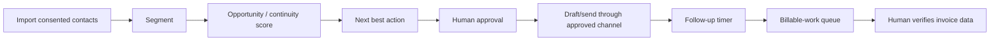

# Photography studio playbook

Status: discovery findings captured; customer identity and commercial acceptance
not yet recorded in this repository.

## Observed problems

- approximately 2,000 contacts are distributed across WhatsApp and spreadsheets;
- past customers do not receive systematic, relevant follow-up;
- promotions and relationship continuity depend on memory;
- completed work may accumulate across many sessions before someone remembers
  what must be invoiced;
- invoicing requires customer name, cédula/RUC, email, and billable detail;
- large photo and video transfers create friction;
- approximately 8 TB of source media remains on local studio servers.

The creative/customer relationship must remain human. FieldSpark supports
continuity and administration; it does not impersonate the photographer's
creative judgment.

## Phase 1 workflow

## Segments

- recent customer;
- lapsed customer;
- family/maternity;
- social/event;
- corporate;
- pending selection/delivery;
- billable work incomplete;
- suppressed/no consent.

No campaign may include a contact without a valid consent/suppression decision.

## Required discovery before import

- sample spreadsheet with synthetic or redacted rows;
- field definitions and data owner;
- duplicates and phone normalization rules;
- consent/source information;
- service catalogue and seasonality;
- invoicing handoff and current system limitations;
- definitions of completed, delivered, billable, invoiced, and paid.

## Billing queue

The agent may create an item containing service, session date, quantity,
customer-data completeness, supporting activity, and suggested description. It
must not issue the Ecuadorian electronic invoice.

## Phase 2 gallery boundary

Only selected, final/current customer deliverables may be uploaded temporarily.
The archive remains local. Storage, egress, retention, and deletion are priced
separately.

## Success metrics

- contacts normalized and consent-classified;
- stale opportunities recovered;
- response and follow-up time;
- appointments generated;
- billable items surfaced;
- invoice-preparation delay;
- opt-out/complaint rate;
- photographer edits to AI drafts.
