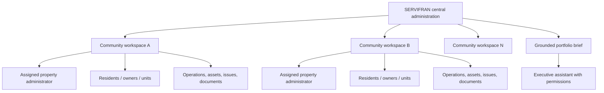

# SERVIFRAN property-management playbook

Status: product requirements; staging tenant only

Last reviewed: 2026-07-30

This document is not legal advice. Local counsel and the competent fire,
municipal, privacy, labor, and emergency authorities must validate each
production procedure.

## Confirmed internal context

Authorized PC Doctor and Notion records identify:

- display name: **SERVIFRAN - Servicios Inmobiliarios**;
- activity: administration of buildings and urbanizations;
- city: Guayaquil;
- manager named in the internal record: Francisco Arteaga;
- current Notion state: lead/proposal with high priority and technical and
  economic viability marked yes;
- interests: automation and smart buildings;
- earlier product hypothesis: modular white-label capabilities per
  urbanization, including access control, CCTV, visitor registration,
  collections support, and AI monitoring.

Still unconfirmed: legal name, RUC, address, website, approved contact channels,
actual managed communities, number of units, contract, price, consent, and
production users.

The PC Doctor address book also contains names that appear associated with
SERVIFRAN, but no account or invitation is created from address-book data
without confirmation.

## Product structure

The central administrator sees portfolio-level risk and commitments. A
property administrator sees only assigned communities. Residents and owners
will later see only records linked to their property and unit.

## Complete capability map

| Domain | Records and actions | AI contribution | Human control |
|---|---|---|---|
| Portfolio | communities, buildings, towers, units, responsible administrator, status | consolidate priorities and stalled work | approve access and assignments |
| Owners and occupants | owner, tenant, occupant, unit, contact, emergency contact, consent, occupancy dates | detect incomplete/duplicate records | verify identity and lawful basis |
| Governance | bylaws, board, assembly, agenda, call, quorum, voting rights, resolutions, minutes, handover | draft agenda/minutes and extract commitments | validate quorum, votes and signed minutes |
| Finance | budgets, dues, reserve fund, receivables, aging, expenses, bank reconciliation | forecast cash gaps and prioritize collection review | approve charges, payments and legal collection |
| Suppliers | vendor, contract, insurance, SLA, quote, purchase, warranty, expiry | compare proposals and flag expirations | select supplier and approve commitment |
| Maintenance | plan, work order, inspection, finding, evidence, technician, downtime | turn audio/photos into structured work and propose next action | confirm diagnosis and completion |
| Asset inventory | asset, make/model, serial, location, useful life, warranty, manuals, parts | recognize new quoted assets and suggest catalog matches | verify asset and valuation |
| Security | guards, shifts, posts, access control, gates, intercom, alarms, electric fence, CCTV | summarize incidents and recurring weak points | authorize access and any external report |
| Fire/life safety | detection, alarms, extinguishers, hoses, pumps, sprinklers, signage, evacuation, inspection dates | surface overdue checks and critical findings | certified inspection and emergency authority |
| Visitors and vehicles | visitor authorization, vehicle, entry/exit, denied attempt, contractor | anomaly detection with strict minimization | approve retention and access policy |
| Coexistence | complaint, rule, noise/pet/common-area issue, mediation, response | classify neutrally and suggest de-escalation | due process; no autonomous sanctions |
| Amenities | reservations, capacity, deposits, incidents, maintenance closures | prevent conflicts and suggest availability | define rules and exceptions |
| Communications | audience, consent, template, draft, approval, delivery, bounce | draft targeted email/WhatsApp notices | approve every outbound campaign initially |
| Meetings and commitments | meeting, task, deadline, owner, reminder, outcome | daily brief and follow-up extraction | confirm calendar and completion |
| Emergencies | type, location, people affected, actions, authorities, evidence, closure | assemble known context and checklist | humans call emergency services and direct response |
| Documents | deeds, horizontal-property declaration, bylaws, contracts, permits, policies, minutes | search, summarize, extract obligations and dates | validate authenticity and legal effect |
| Privacy and audit | purpose, lawful basis, consent, role, access log, retention, incident | detect over-collection and unusual access | privacy owner approves policy and response |
| Reporting | portfolio KPIs, SLA, backlog, cash, risk, community health | explain changes with links to source records | management accepts conclusions |

## Critical-system inventory

The initial inventory supports electric fence, fire detection and suppression,
CCTV, access control, alarms, elevators, pumps, generator, water, lighting,
gas, gates, intercom, playgrounds, pools, and other assets. Each system needs
condition, quantity, location, latest inspection, next inspection, evidence,
responsible party, warranty, and open findings.

“Operational” is never inferred merely because no incident was reported.
Unknown is a valid and visible state.

## Issue and incident taxonomy

- security and unauthorized access;
- fire/life safety;
- coexistence and community rules;
- preventive or corrective maintenance;
- infrastructure and utilities;
- finance and collections;
- governance and assemblies;
- legal or regulatory follow-up;
- communication;
- personnel and shifts;
- supplier performance;
- emergency;
- other, pending classification.

Audio, email, WhatsApp, meeting notes, forms, and system alerts can become an
issue. The original file remains traceable; the AI extraction stores confidence
and missing fields; a human confirms critical facts.

## Assistant questions the model must answer

- “¿Qué requiere atención hoy en todas las urbanizaciones?”
- “¿Qué está pasando en Villa Blanca y quién es responsable?”
- “¿Cómo está el cerco eléctrico y cuándo fue su última revisión?”
- “¿Qué compromisos salieron de la reunión y cuáles están vencidos?”
- “¿Qué proveedores o garantías vencen este mes?”
- “¿Qué novedades se repiten entre comunidades?”
- “Prepara un correo para los residentes afectados, sin enviarlo.”

Every answer must link to source records, state freshness, expose uncertainty,
respect property scope, and keep outbound actions in draft until approval.

## Delivery sequence

### Implemented foundation

- fourth staging tenant and playbook;
- central portfolio plus isolated property records;
- assigned property administrator field and permission boundary;
- critical-system inventory;
- issue capture;
- meeting/task commitments;
- deterministic portfolio and property brief;
- synthetic UI and automated tenant-isolation tests.

### Next controlled increment

- structured audio transcription into issue/inspection drafts;
- units, owners, occupants, consent, and emergency contacts;
- property-level administrator assignment from invited users;
- document vault and assembly/contract expiration extraction;
- approved email and calendar adapters in draft/shadow mode;
- recurring inspections and reminders;
- Gemini grounded Q&A over the portfolio brief.

### Later production modules

- collections and budgets;
- resident portal and amenity reservations;
- visitor/access integrations;
- CCTV metadata or event integration (not unrestricted video ingestion);
- supplier purchase and payment workflows;
- approved WhatsApp;
- electronic invoicing only after the separate Ecuador flow is validated.

## Ecuador guardrails

- The current Property Horizontal Law and its regulation govern common
  property, administration, assemblies, and funds. The product stores evidence
  and approvals but does not decide legal validity.
- The 2026 National Assembly proposal about digital owner/occupancy registers,
  transparency, and community security is tracked as a trend, not represented
  as enacted law.
- Resident, visitor, access, camera, and incident records are personal data.
  Apply purpose limitation, minimization, role-based access, retention,
  security controls, and data-subject procedures before production.
- Administrators do not receive autonomous police, investigative, eviction, or
  utility-disconnection powers through FieldSpark.

Official references:

- Ecuador Property Horizontal Law:
  https://www.gob.ec/sites/default/files/regulations/2024-11/LEY_DE_PROPIEDAD_HORIZONTAL.pdf
- Ecuador Personal Data Protection Law, Official Register 459:
  https://www.registroficial.gob.ec/quinto-suplemento-al-registro-oficial-no-459/
- 2026 reform project status:
  https://www.asambleanacional.gob.ec/es/node/115171
